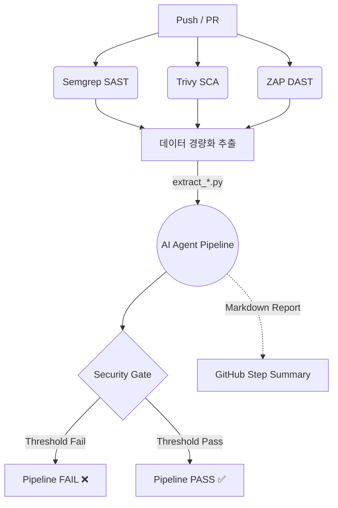

# AIR — 자율방어 vuln-lab (`feature/air-defense`)

> **AIR (Automated Incident Response)** — 실시간 위협 대응 DevSecOps 자동화 팀 프로젝트.
> 본 브랜치(`feature/air-defense`)는 [`feature/web`](../../tree/feature/web)의 취약 앱에
> **자율방어(AIR)** 를 얹은 적용본입니다. 공격을 스스로
> **탐지 → 즉시 차단 → 인시던트 기록 → 위험도 산정 → Discord 경고 → (자동 소스패치)** 로 대응합니다.

> ⚠️ 의도적 취약점을 포함한 **vuln-lab**. 격리 스택(`:8081`)에서 신뢰 IP 로만 구동하세요.

---

## 기술 스택

| 영역 | 내용 |
|---|---|
| Backend | Java 21, Spring Boot 3.3.5, Spring Security + JJWT, MyBatis 3, SQLite |
| AIR 방어 | `com.shop.air` (DetectionFilter · DefenseRegistry · IncidentService · DynamicRuleRegistry) |
| 오케스트레이터 | `air-orchestrator/` (Python: responder.py · knowledge.py · verify.sh) — 자동 소스패치 |
| Frontend | 순수 HTML/CSS/JS SPA (+ 🛡 **AIR IR 대시보드**) |
| Infra | Docker, docker-compose(`-p airlab`), nginx `:8081` |

## 자율방어 구조 (플래그 토글)

- 취약 코드와 방어 가드가 **한 코드베이스에 공존**. `DefenseRegistry` 플래그로 전환(**기본 OFF = 취약**).
- 공격 탐지 시 AIR 가 해당 플래그를 **즉시 ON** → 같은 요청부터 차단(자율방어 폐루프).
- DB 영속 → 재기동 후에도 방어 상태 보존.

## 방어 가드

| 플래그 | 대응 취약점 |
|---|---|
| `order.qty-guard` | 음수수량 주문(잔액 증식) |
| `sql.injection-guard` | SQL Injection (`${}` 동적쿼리) |
| `xss.input-guard` | Stored XSS |
| `authz.idor-guard` | IDOR (타인 주문 열람) |
| `ddos.rate-guard` | DDoS (요청 폭주 rate-limit) |
| `ransom.massdelete-guard` | 랜섬형 대량 삭제 |
| `upload.file-guard` | 파일 업로드 (확장자 무검증·경로조작·LFI) |
| `air.detection` / `anomaly.detection` | 시그니처 탐지 / 미지공격 이상탐지(4xx·5xx 버스트) |
| `air.shield` | 이상 출처 격리(쿨다운 차단) |

## 탐지 → 대응 폐루프

1. **DetectionFilter**(인라인): SQLi(q), XSS/음수수량(본문), DDoS/랜섬(rate), 4xx/5xx 이상탐지
   + **UploadService.autoDetect**(악성 파일명/경로조작)
2. **IncidentService.report** → ① 방어 플래그 즉시 ON ② 인시던트 기록 ③ **Risk Score** 산정 ④ **Discord 경고**
3. **air-orchestrator/responder.py** → LLM/템플릿 **자동 소스패치** → `verify.sh` 재공격 검증 → 커밋

## IR 자동대응

- **Risk Score**: 유형 → severity(CRITICAL/HIGH/MEDIUM/LOW) + score(0~100). `/air/incidents` 응답에 enrich.
  (SQLi/랜섬 95, 업로드악성 90, 음수수량/경로조작 85, IDOR 80, XSS 75, DDoS 70, 이상 50~60)
- **Discord 웹훅**: 환경변수 `AIR_DISCORD_WEBHOOK`. 인시던트마다 위험도 포함 경고를 **비동기 전송**(미설정 시 no-op).
- **IR 대시보드**: `super_admin` 로그인 → 상단 **🛡 AIR** — 방어 플래그 토글 + 인시던트(위험도 뱃지/유형/IP/조치/시각) 실시간.

## AIR 제어 API (super_admin)

```
GET  /api/v1/air/defenses                 # 방어 플래그 상태
POST /api/v1/air/defenses/{key}/enable    # / disable
GET  /api/v1/air/incidents?limit=         # severity/riskScore 포함
GET  /api/v1/air/rules  · POST · DELETE /rules/{id}   # 런타임 동적 룰
```

## 빠른 시작 (vuln-lab)

```bash
# .env: JWT_ACCESS_SECRET / JWT_REFRESH_SECRET / ADMIN_PASSWORD (강하게)
#       AIR_DISCORD_WEBHOOK=<디스코드 웹훅 URL>   (선택, IR 알림)
docker-compose -p airlab -f docker-compose.lab.yml up -d --build
# 접속: http://<호스트>:8081/     로그인: super_admin 계정(.env 의 ADMIN_USERNAME / ADMIN_PASSWORD)
```
시드 데이터: 테넌트 **`demo`**(데모상점) + 상품 4 + 데모 고객 1(계정/비번은 시드 스크립트에서 설정, 잔액 50만).

## 데모 플로우

```
1) 공격      python air-attack/attack.py <시나리오> --base http://<host>:8081 \
                    --admin-user <super_admin> --admin-pass '<password>'
2) 자율방어  탐지 → 가드 자동 ON(DEFENDED) + Discord 경고 + 대시보드 인시던트
3) (선택)    air-orchestrator/responder.py 로 자동 소스패치 시연
```
시나리오: `negative-qty · sqli · xss · idor · upload · ddos · ransom · unknown` (취약=exit1 / 방어=exit0)

## 오케스트레이터 (자동 소스패치)

- `knowledge.py` : 취약 유형별 패치 템플릿/검증(음수수량·SQLi·XSS·IDOR·**업로드**)
- `responder.py` : 인시던트 폴링 → LLM/휴리스틱 패치 → `verify.sh` 재공격 검증 → 커밋
  - 무료 데모: `responder.py --heuristic` / 실제 LLM: `AIR_LLM_PROVIDER`(anthropic|gemini|groq)
- **자동패치 안전장치(#6)**: 자동 반영은 격리 브랜치(`air/auto-patch/*`)까지만 — base 직접 push/머지 없음.
  LLM 생성 패치는 검증식 + **정적 스캔**(OS실행/리플렉션/역직렬화/네트워크/난독/파괴적삭제/하드코딩키/인가무력화)을
  모두 통과해야 채택(실패 시 결정적 템플릿 폴백). LLM 패치는 **사람 리뷰 게이트**(`--allow-llm-push` 없으면 push 보류).
  `--regression` 으로 재공격 차단 확인 후 정상기능 회귀 스모크까지 수행.

## 운영 주의

- 시연 후 **`/air/rules` 전삭제**(단일 nginx IP 환경에서 IP 차단룰이 전체차단 방지). 신뢰 IP 화이트리스트는 선택.
- `.env`, `*.pem`, 웹훅 URL은 **커밋 금지**. 의도적 취약 — 격리/신뢰 IP 전용.

## 보안 특성과 한계 (데모 주의)

- **시그니처는 시연용, 실제 방어는 anomaly + guard(#7)**: `SQLI/XSS` 등 정규식 시그니처는
  인코딩·주석삽입(`/**/`)·변형 페이로드로 우회될 수 있다. 신뢰하는 방어선은 (1) 이상탐지(5xx/4xx 스캔)→
  `air.shield` 출처격리 + 동적룰, (2) 각 유형별 런타임 가드(플래그)이며, 시그니처는 데모 가독성을 위한 보조다.
- **위험도 스코어는 유형 기반 정적값(#10)**: `RiskScoring` 은 유형→점수 고정 매핑(무영속·무집계)으로,
  반복 횟수/성공 여부/노출량을 반영하지 않는다. 반복·컨텍스트 가중과 대시보드 집계는 인시던트에 severity를
  **영속(스키마 마이그레이션)** 한 뒤 확장하는 것을 향후 과제로 둔다.
- **XSS 시연의 층위(#8)**: nginx 가 `Content-Security-Policy: script-src 'self'` 를 **web·defense 양쪽
  모든 응답(`/api` 프록시 포함, server 블록 상속)** 에 적용한다(실측 확인). 따라서 same-origin 으로 저장/업로드된
  인라인 스크립트는 어느 브랜치에서도 브라우저 실행이 차단된다. `xss` 시나리오가 web 에서 VULNERABLE 로
  뜨는 것은 **앱 계층(저장/반사 시 이스케이프 누락)** 취약을 검증하기 때문이며 브라우저 alert 실행과는 별개다.
  → 정직한 시연: web 응답 JSON 에 payload 가 **미이스케이프**로 저장/반사됨을(defense 는 이스케이프됨) 보여줘
  코드계층 취약/방어를 대비. 굳이 alert 를 띄우려면 CSP 밖 컨텍스트(다운로드한 파일 `file://` 또는 CSP 완화
  데모 페이지)에서 확인하고, 이는 CSP 라는 별도 방어층 밖의 영향임을 명시한다.

## 브랜치 구도

`feature/web`(취약 baseline `:80`) ↔ **`feature/air-defense`**(자율방어 `:8081`) / `feature/air-attack`(DAST) / `dev`(CI).

---
_학습/보안 실습용 자율방어 테스트베드입니다._
<br />
<br />
# AIR — LLM 기반 위험성 재평가 및 리포트 작성 (`feature/risk-eval-agent`)

# AI-Driven DevSecOps Pipeline

애플리케이션의 개발 라이프사이클(CI/CD) 내에 **SAST, DAST, SCA(의존성)** 스캔을 자동화하고, **LangGraph 기반의 다중 AI 에이전트(GPT-4o-mini)**를 도입하여 취약점 오탐(False Positive)을 걸러내고 비즈니스 위험도를 재평가하는 지능형 DevSecOps 파이프라인.

## 주요 기능 및 특징 (Key Features)

1. **최적화된 3대 보안 스캔 통합**
   * **SAST (Semgrep):** Spring Boot, MyBatis, JWT, Vanilla JS 환경에 최적화된 룰 적용 및 노이즈(테스트 코드, 파이썬 스크립트) 차단.
   * **SCA (Trivy):** 컨테이너 이미지 및 오픈소스 의존성 취약점 탐지.
   * **DAST (ZAP):** `zap-full-scan.py`를 활용한 능동형(Active) 웹 모의해킹 및 공격 페이로드 주입 테스트.
2. **이식성(Portability)을 고려한 아키텍처**
   * 타겟 애플리케이션의 의존성 관리 도구(Poetry, Maven 등)와 보안 파이프라인 분리.
   * 내장 `pip`와 독립적인 `requirements.txt`를 사용하여 어떠한 레포지토리 환경에서도 복사-붙여넣기만으로 동작 가능.
3. **LangGraph 다중 에이전트 기반 오탐 검증 (Zero-Trust)**
   * 스캐너의 맹목적인 결과를 그대로 믿지 않고, AI가 실제 코드 문맥과 방어로직을 파악하여 **가짜 취약점(오탐)을 조기에 차단(Early Exit)**.
   * 토큰 낭비 방지 및 GPT-4o-mini의 성능 한계 극복을 위한 **단일 책임(Single Responsibility) 노드 분리 설계**.

---

## 파이프라인 아키텍처 (Workflow)

CI/CD 파이프라인은 병렬로 보안 스캔을 수행한 후, `summary` Job에서 데이터를 정제하여 AI 에이전트에게 넘기는 Funnel 구조.



---

## AI 에이전트 상세 구조 (Phase 1 ~ 4)

AI 파이프라인(`run_ai_pipeline.py`)은 LangGraph를 통해 4단계의 컨베이어 벨트로 동작.

* **[Phase 1] 정보 추출기 (Extractor):** 
  * 원본 데이터에서 인증 데코레이터, 방어 로직, DB 모델 등 팩트(Fact)만 추출하여 구조화(JSON).
  * *전처리:* Python 스크립트가 취약점 위아래 ±30줄을 잘라서 직접 주입(Direct Feed)하여 어텐션 분산 방지.
* **[Phase 2] 오탐 판별기 (Triage):**
  * Phase 1의 팩트를 바탕으로 취약점의 실제 트리거 가능성을 판단.
  * *조건부 라우팅(Conditional Edge):* 오탐(False Positive)으로 판명될 경우, 복잡한 위험도 평가(Phase 3)를 건너뛰고 리포트(Phase 4)로 직행하여 비용 절감.
* **[Phase 3] 비즈니스 위험도 평가기 (Assessor):**
  * 시스템 컨텍스트(디렉토리 트리, OS, 스택)와 발견된 취약점의 노출 범위를 고려하여 최종 CVSS 위험도(Critical ~ Low) 재조정.
* **[Phase 4] 리포트 작성기 (Reporter):**
  * 개발자와 보안 담당자가 읽기 쉬운 통합 Markdown 리포트 렌더링.

---

## 디렉토리 구조 (Directory Structure)

```text
.github/workflows/
 └── security.yml               # CI/CD 파이프라인 메인 엔트리포인트

scripts/
 ├── generate_summary.py        # 전체 스캔 통계 카운트 스크립트
 ├── extract_semgrep.py         # SAST 리포트 LLM용 경량화
 ├── extract_trivy.py           # 의존성 리포트 LLM용 경량화
 ├── extract_zap.py             # DAST 리포트 LLM용 경량화
 │
 └── ai_agent/                  # 🤖 AI 파이프라인 독립 격리 공간
      ├── requirements.txt      # AI 구동을 위한 독립 의존성 (Poetry 대체)
      ├── state.py              # Pydantic 기반 스키마 및 LangGraph 상태 장부
      ├── nodes.py              # Phase 1~4 에이전트 로직
      ├── graph.py              # LangGraph 노드 및 조건부 엣지 조립
      ├── tools.py              # 코드 청킹, 디렉토리 트리 추출 유틸리티
      └── run_ai_pipeline.py    # AI 파이프라인 실행 메인 스크립트

policy/
 ├── security_gate.py           # 임계치(Threshold) 기반 CI 통제 로직
 └── security_policy.json       # 각 스캐너별 허용 임계치 설정 파일
```

---

## 초기화 및 테스트

### 1. 필수 환경 변수 설정
이 파이프라인이 정상적으로 동작하려면 GitHub 레포지토리의 **Secrets**에 OpenAI API Key 등록 필요.
* `Settings` > `Secrets and variables` > `Actions` 이동
* `OPENAI_API_KEY`

### 2. 파이프라인 동작 확인 (GitHub Actions)
1. 코드를 `dev` 또는 `main` 브랜치에 Push하거나 Pull Request를 생성.
2. `security.yml` 워크플로우가 자동으로 트리거 됨.
3. 파이프라인 완료 후, 해당 Run 페이지의 **Summary 탭** 하단에서 AI가 작성한 `🤖 AI DevSecOps Integrated Security Report` 마크다운을 확인 가능.

### 3. 향후 확장성 (Next Steps)
* **Agentic Tool Calling 도입:** SAST/DAST 분석 중 문맥이 부족할 경우, LLM이 직접 디렉토리를 탐색하고 추가 파일을 읽어올 수 있도록 Phase 1 로직 고도화.
* **리포트 언어 한국어로 변경:** 최종 리포트를 한국어로 출력하도록 수정.

---
