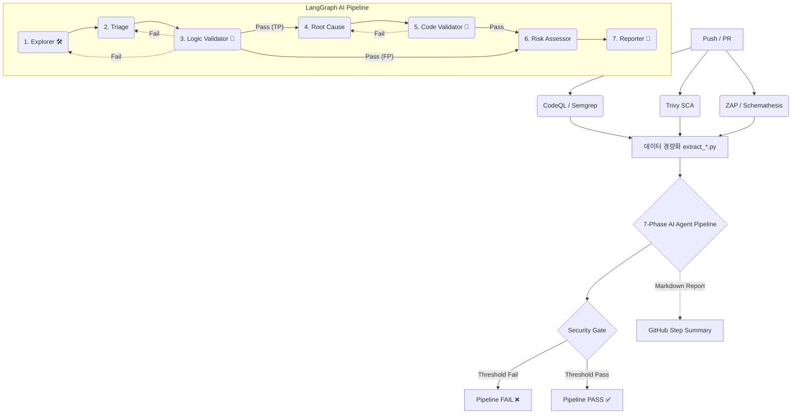

---

# AI-Driven DevSecOps Pipeline (7-Phase Agentic Architecture)

애플리케이션의 개발 라이프사이클(CI/CD) 내에 **SAST(Semgrep, CodeQL), DAST(ZAP), API Fuzzing(Schemathesis), SCA(Trivy)** 스캔을 자동화하고, **LangGraph 기반의 7단계 자율 탐색 및 이중 검증 AI 에이전트**를 도입하여 취약점 오탐(False Positive)을 제로화하고 비즈니스 위험도를 재평가하는 지능형 DevSecOps 파이프라인입니다.

## 주요 기능 및 특징 (Key Features)

1. **최적화된 Advanced 보안 스캔 통합**
* **SAST (CodeQL & Semgrep):** Data Flow 기반 심층 추적(CodeQL)과 프레임워크 최적화 룰(Semgrep) 적용.
* **SCA (Trivy):** 컨테이너 이미지 및 오픈소스 의존성 취약점 탐지.
* **DAST & Fuzzing (ZAP, Schemathesis):** 능동형(Active) 웹 모의해킹 및 API 엣지 케이스 페이로드 주입 테스트.


2. **LangGraph 자율 탐색 에이전트 (Agentic Tool Calling)**
* 단순한 텍스트 청크 주입을 넘어, AI가 샌드박스 환경 내에서 `search_files`, `read_file_range` 도구를 자율적으로 호출하여 실제 코드 문맥과 방어 로직을 탐색하고 팩트를 수집합니다.


3. **이중 타겟 회귀 및 서킷 브레이커 (Two-Tier Validation & Circuit Breaker)**
* **Zero-Trust 검증:** 스캐너의 결과를 맹신하지 않고, 논리적 오류나 코드 문법 오류 발생 시 정확히 원인이 된 노드로 타겟을 지정해 재실행(Loop-back)합니다.
* 무한 루프 방지를 위한 **서킷 브레이커** 패턴이 적용되어 있어, 최대 재시도 초과 시 리포트에 강제 경고 배너를 노출합니다.


4. **다중 LLM 공급자 지원 (Provider Seam)**
* 로컬 모델(Ollama) 및 OpenAI, Anthropic, Gemini 등 다양한 환경 변수만으로 자유롭게 LLM 벤더를 교체할 수 있습니다.


---

## 파이프라인 아키텍처 (Workflow)

CI/CD 파이프라인은 병렬로 보안 스캔을 수행한 후, 데이터를 정제하여 7단계의 AI 에이전트 컨베이어 벨트로 넘깁니다.



---

## 7-Phase AI 에이전트 상세 구조

파이프라인은 단일 책임 원칙(SRP)에 따라 7개의 독립적인 노드(Node)로 동작합니다.

* **[Phase 1] 탐색가 (Explorer):** 스캐너 종류에 관계없이 도구(`search_files`, `read_file_range`)를 사용하여 코드를 직접 뒤져 팩트를 수집하고 감사 추적(Audit Trail) 로그를 남깁니다.
* **[Phase 2] 오탐 판별기 (Triage):** 수집된 팩트만을 바탕으로 스캐너의 경고가 진짜(TP)인지 가짜(FP)인지 입증 책임(Burden of Proof) 원칙 하에 판별합니다.
* **[Phase 3] 1차 검증기 (Logic Validator):** 수집된 증거와 판별 논리가 타당한지 교차 검증합니다. 실패 시 Phase 1(팩트 부족) 또는 Phase 2(논리 오류)로 타겟 회귀시킵니다. 오탐(FP)일 경우 Phase 4, 5를 건너뛰어 비용을 절감합니다.
* **[Phase 4] 근본 원인 분석기 (Root Cause):** 정탐(TP) 취약점에 한해 근본 원인과 구체적인 패치 코드를 작성합니다.
* **[Phase 5] 2차 검증기 (Code Validator):** 제안된 패치 코드의 문법적 무결성과 환각(Hallucination) 여부를 검증하며, 실패 시 Phase 4로 회귀시킵니다.
* **[Phase 6] 위험도 재평가 (Risk Assessor):** 프레임워크 기본 보안 설정(Framework Shield)과 내부망 등 타겟 인프라 환경을 고려하여 최종 CVSS 위험도를 재평가합니다.
* **[Phase 7] 리포트 작성기 (Reporter):** 엄격한 마크다운 템플릿을 적용하여 통합 리포트를 생성합니다. (검증 실패 시 서킷 브레이커 경고 배너 삽입)

---

## 디렉토리 구조 (Directory Structure)

```text
.github/workflows/
 └── security.yml               # CI/CD 파이프라인 메인 엔트리포인트

scripts/
 ├── extract_*.py               # 각 스캐너 리포트 LLM용 경량화
 ├── llm/
 │    └── run-ai.sh             # AI 파이프라인 구동 쉘 스크립트
 │
 └── ai_agent/                  # 🤖 AI 파이프라인 독립 격리 공간 (LangGraph)
      ├── requirements.txt      # AI 구동을 위한 독립 의존성
      ├── agent_config.yaml     # 탐색 도구 제한 및 샌드박스 정책 설정
      ├── state.py              # Pydantic 기반 스키마 및 LangGraph 상태 장부
      ├── nodes.py              # Phase 1~7 에이전트 로직
      ├── routers.py            # 타겟 회귀(Loop-back) 라우팅 통제
      ├── workflow.py           # LangGraph 노드 및 조건부 엣지 조립
      ├── tools.py              # 파일 탐색 및 읽기 도구 (Tool Calling)
      ├── provider.py           # 다중 LLM 공급자 Seam 로직
      └── run_ai_pipeline.py    # AI 파이프라인 실행 메인 스크립트

policy/
 ├── security_gate.py           # 임계치(Threshold) 기반 CI 통제 로직
 └── security_policy.json       # 각 스캐너별 허용 임계치 설정 파일

```

---

## 초기화 및 테스트

### 1. 필수 환경 변수 설정

LLM Provider Seam이 적용되어 있어 선호하는 AI API Key를 GitHub **Secrets**에 등록하여 사용할 수 있습니다.

* `Settings` > `Secrets and variables` > `Actions` 이동
* 사용 모델 지정: `AIR_LLM_PROVIDER` (기본값 설정 권장, 예: `openai`, `anthropic`, `local`)
* API Key: `OPENAI_API_KEY`, `ANTHROPIC_API_KEY`, `GEMINI_API_KEY` 중 택 1

### 2. 파이프라인 동작 확인 (GitHub Actions)

1. 코드를 `dev` 또는 `main` 브랜치에 Push하거나 Pull Request를 생성합니다.
2. `security.yml` 워크플로우가 자동으로 트리거 됩니다.
3. 파이프라인 완료 후, 해당 Run 페이지의 **Summary 탭** 하단에서 AI가 작성한 `🤖 AI DevSecOps Integrated Security Report` 마크다운을 확인 가능합니다. (json 파일로도 상세 분석 결과가 동시 출력됩니다.)

### 3. 향후 확장성 (Next Steps)

* **취약점 연관 분석 및 중복 제거 (Correlation & Deduplication):** SAST(CodeQL)와 DAST(ZAP)가 동일한 취약점을 탐지했을 때, 이를 교차 검증하여 단일 리포트로 병합하는 노드 추가.