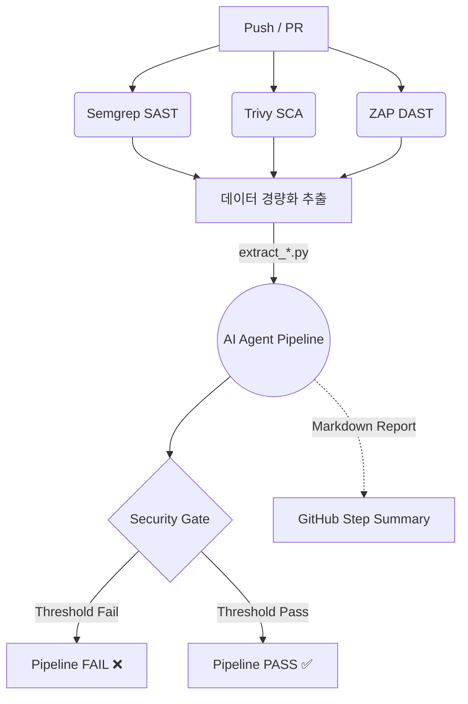

---

# AI-Driven DevSecOps Pipeline

애플리케이션의 개발 라이프사이클(CI/CD) 내에 **SAST, DAST, SCA(의존성)** 스캔을 자동화하고, **LangGraph 기반의 다중 AI 에이전트(GPT-4o-mini)**를 도입하여 취약점 오탐(False Positive)을 걸러내고 비즈니스 위험도를 재평가하는 지능형 DevSecOps 파이프라인.

## 주요 기능 및 특징 (Key Features)

1. **최적화된 3대 보안 스캔 통합**
   * **SAST (Semgrep):** Spring Boot, MyBatis, JWT, Vanilla JS 환경에 최적화된 룰 적용 및 노이즈(테스트 코드, 파이썬 스크립트) 차단.
   * **SCA (Trivy):** 컨테이너 이미지 및 오픈소스 의존성 취약점 탐지.
   * **DAST (ZAP):** `zap-full-scan.py`를 활용한 능동형(Active) 웹 모의해킹 및 공격 페이로드 주입 테스트.
2. **이식성(Portability)을 고려한 아키텍처**
   * 타겟 애플리케이션의 의존성 관리 도구(Poetry, Maven 등)와 보안 파이프라인 분리.
   * 내장 `pip`와 독립적인 `requirements.txt`를 사용하여 어떠한 레포지토리 환경에서도 복사-붙여넣기만으로 동작 가능.
3. **LangGraph 다중 에이전트 기반 오탐 검증 (Zero-Trust)**
   * 스캐너의 맹목적인 결과를 그대로 믿지 않고, AI가 실제 코드 문맥과 방어로직을 파악하여 **가짜 취약점(오탐)을 조기에 차단(Early Exit)**.
   * 토큰 낭비 방지 및 GPT-4o-mini의 성능 한계 극복을 위한 **단일 책임(Single Responsibility) 노드 분리 설계**.

---

## 파이프라인 아키텍처 (Workflow)

CI/CD 파이프라인은 병렬로 보안 스캔을 수행한 후, `summary` Job에서 데이터를 정제하여 AI 에이전트에게 넘기는 Funnel 구조.



---

## AI 에이전트 상세 구조 (Phase 1 ~ 4)

AI 파이프라인(`run_ai_pipeline.py`)은 LangGraph를 통해 4단계의 컨베이어 벨트로 동작.

* **[Phase 1] 정보 추출기 (Extractor):** 
  * 원본 데이터에서 인증 데코레이터, 방어 로직, DB 모델 등 팩트(Fact)만 추출하여 구조화(JSON).
  * *전처리:* Python 스크립트가 취약점 위아래 ±30줄을 잘라서 직접 주입(Direct Feed)하여 어텐션 분산 방지.
* **[Phase 2] 오탐 판별기 (Triage):**
  * Phase 1의 팩트를 바탕으로 취약점의 실제 트리거 가능성을 판단.
  * *조건부 라우팅(Conditional Edge):* 오탐(False Positive)으로 판명될 경우, 복잡한 위험도 평가(Phase 3)를 건너뛰고 리포트(Phase 4)로 직행하여 비용 절감.
* **[Phase 3] 비즈니스 위험도 평가기 (Assessor):**
  * 시스템 컨텍스트(디렉토리 트리, OS, 스택)와 발견된 취약점의 노출 범위를 고려하여 최종 CVSS 위험도(Critical ~ Low) 재조정.
* **[Phase 4] 리포트 작성기 (Reporter):**
  * 개발자와 보안 담당자가 읽기 쉬운 통합 Markdown 리포트 렌더링.

---

## 디렉토리 구조 (Directory Structure)

```text
.github/workflows/
 └── security.yml               # CI/CD 파이프라인 메인 엔트리포인트

scripts/
 ├── generate_summary.py        # 전체 스캔 통계 카운트 스크립트
 ├── extract_semgrep.py         # SAST 리포트 LLM용 경량화
 ├── extract_trivy.py           # 의존성 리포트 LLM용 경량화
 ├── extract_zap.py             # DAST 리포트 LLM용 경량화
 │
 └── ai_agent/                  # 🤖 AI 파이프라인 독립 격리 공간
      ├── requirements.txt      # AI 구동을 위한 독립 의존성 (Poetry 대체)
      ├── state.py              # Pydantic 기반 스키마 및 LangGraph 상태 장부
      ├── nodes.py              # Phase 1~4 에이전트 로직
      ├── graph.py              # LangGraph 노드 및 조건부 엣지 조립
      ├── tools.py              # 코드 청킹, 디렉토리 트리 추출 유틸리티
      └── run_ai_pipeline.py    # AI 파이프라인 실행 메인 스크립트

policy/
 ├── security_gate.py           # 임계치(Threshold) 기반 CI 통제 로직
 └── security_policy.json       # 각 스캐너별 허용 임계치 설정 파일
```

---

## 초기화 및 테스트

### 1. 필수 환경 변수 설정
이 파이프라인이 정상적으로 동작하려면 GitHub 레포지토리의 **Secrets**에 OpenAI API Key 등록 필요.
* `Settings` > `Secrets and variables` > `Actions` 이동
* `OPENAI_API_KEY`

### 2. 파이프라인 동작 확인 (GitHub Actions)
1. 코드를 `dev` 또는 `main` 브랜치에 Push하거나 Pull Request를 생성.
2. `security.yml` 워크플로우가 자동으로 트리거 됨.
3. 파이프라인 완료 후, 해당 Run 페이지의 **Summary 탭** 하단에서 AI가 작성한 `🤖 AI DevSecOps Integrated Security Report` 마크다운을 확인 가능.

### 3. 향후 확장성 (Next Steps)
* **Agentic Tool Calling 도입:** SAST/DAST 분석 중 문맥이 부족할 경우, LLM이 직접 디렉토리를 탐색하고 추가 파일을 읽어올 수 있도록 Phase 1 로직 고도화.
* **리포트 언어 한국어로 변경:** 최종 리포트를 한국어로 출력하도록 수정.

---